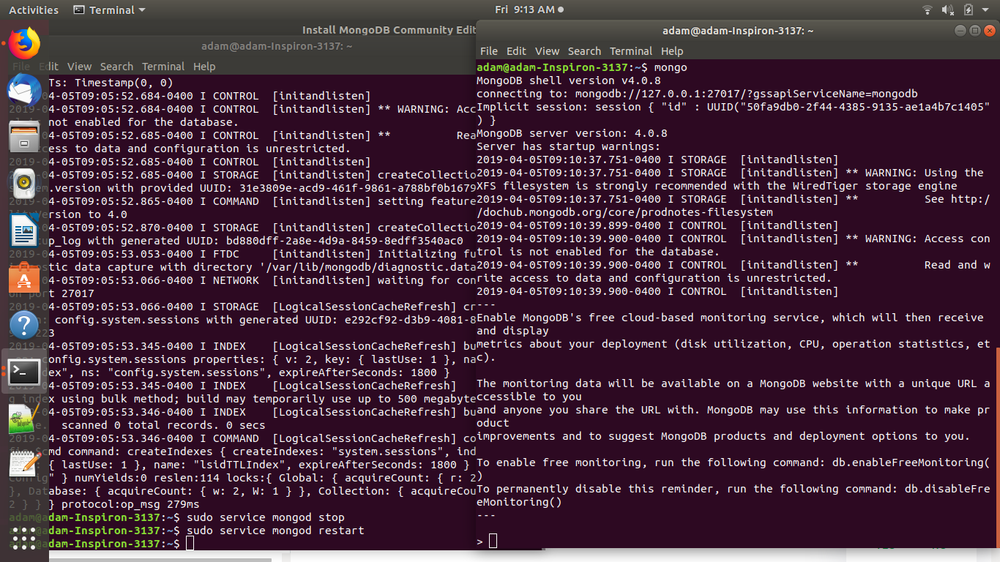
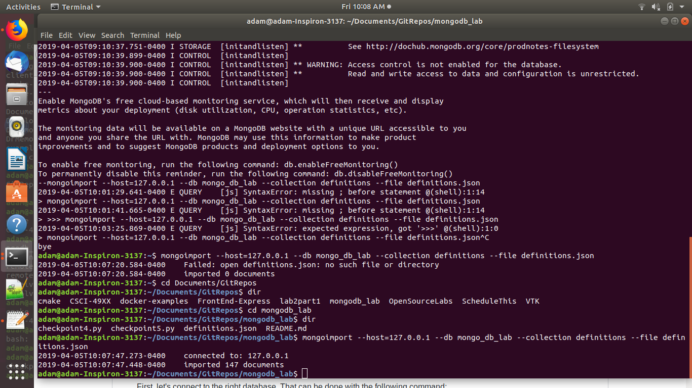
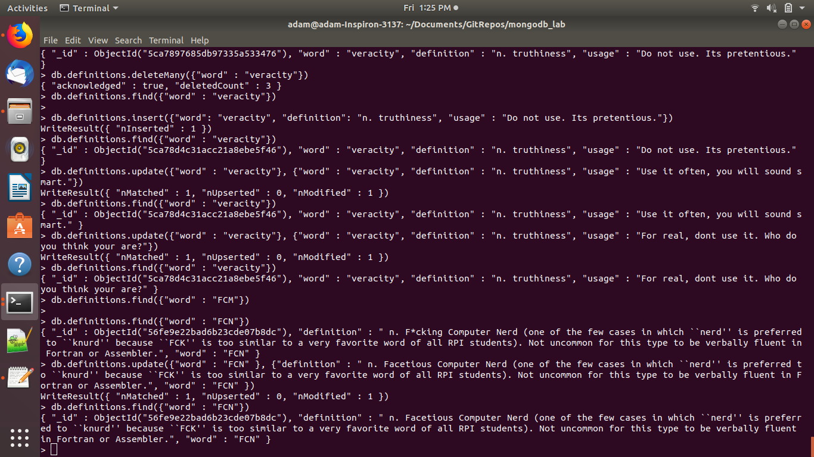
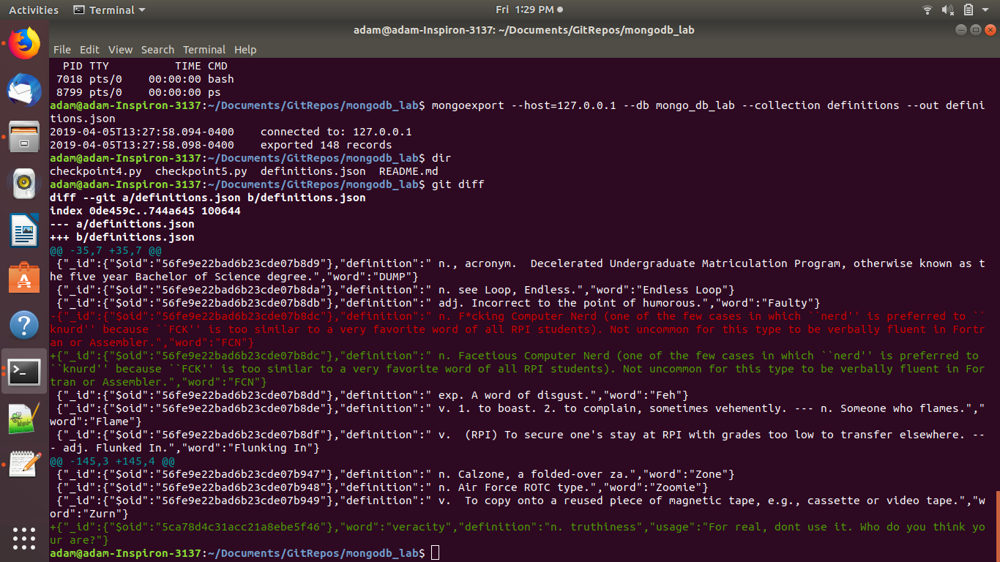
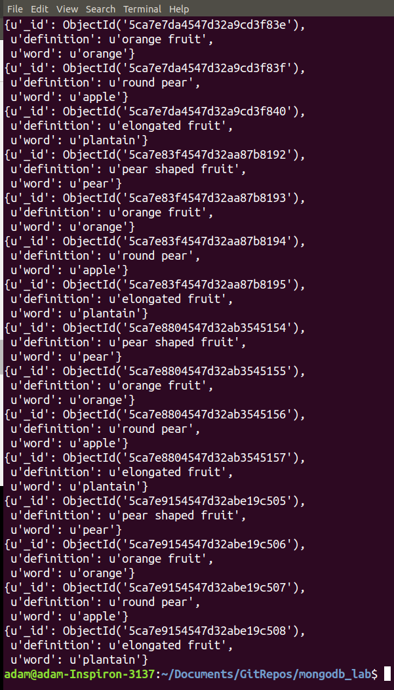
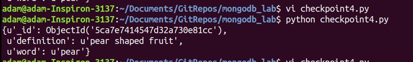
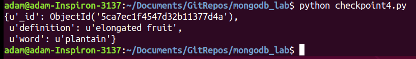
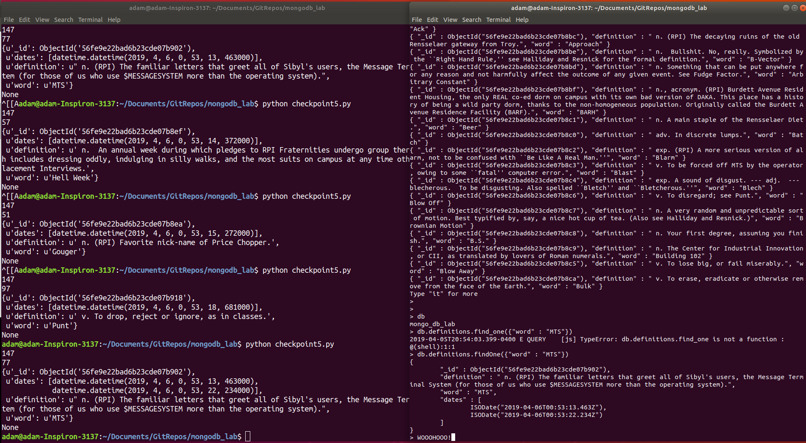

## Lab10: Adam Gibbons

My output for checkpoints one and two is different than the assignment suggested it would be, but everything worked.

### Checkpoint 1:

### Checkpoint 2:

### Checkpoint 3:

All commands should be in this pic:

Comparing changes to original:

### Checkpoint 4:

This checkpoint is kind of a mess for me. I didnt realize there was such a simple way to get at the current client databases. I was trying to read the json file for a while, and ended up inserting fruits into a fruit database... all the operations are the same... (I figured out how to do it right for checkpoint 5)

Find all:
(Because I had inserts in checkpoint4.py, and re-ran it several times while debugging, this db has tons of duplicates....)

Find by word: (find one is in the script, no pic though)

Find by id:

Script:

[link to checkpoint4.py](https://github.com/gibboa/OpenSourceLabs/blob/master/lab10/checkpoint4.py)

### Checkpoint 5:

Got lucky with a duplicate random selection of 'MTS' pretty quickly:

Script:

[link to checkpoint5.py]()
