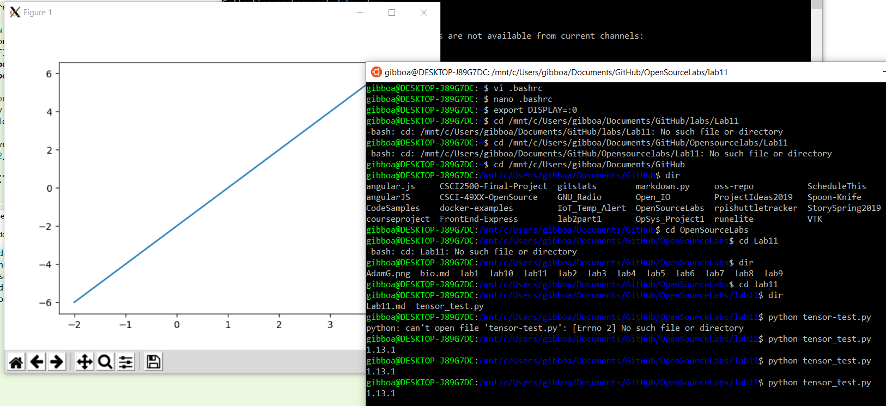
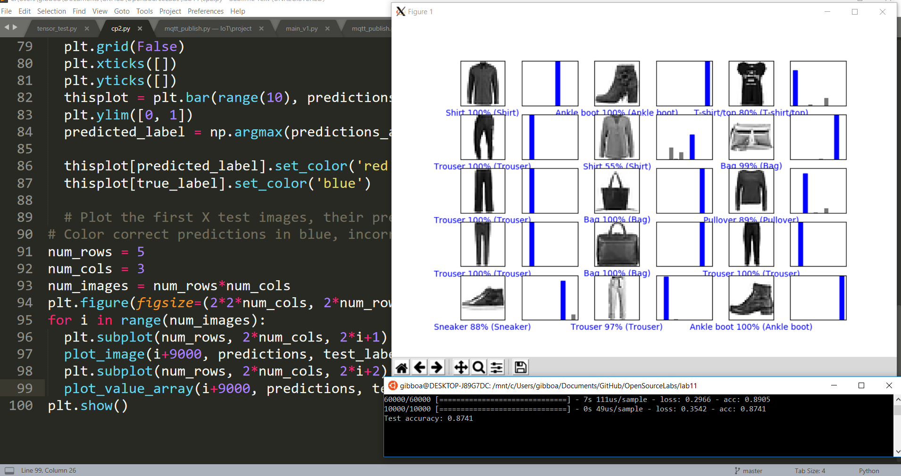
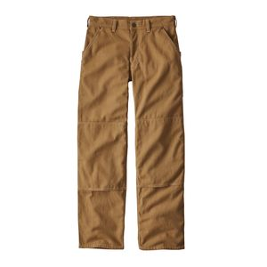
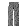
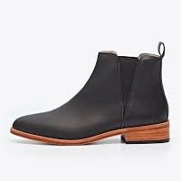
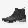
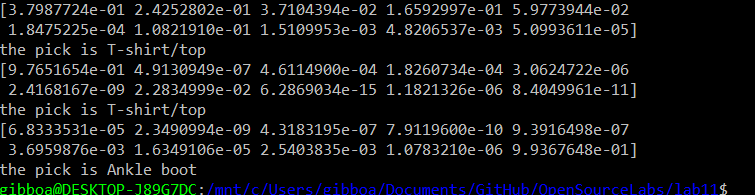

## Adam Gibbons Lab 11

### checkpoint 1

### checkpoint 2

### checkpoint 3

(wasnt sure if u wanted inverted or not for the image... so both)

33% of the time, it works 100% of the time...

(at least 2/3 each time though ... assuming I did it right)
