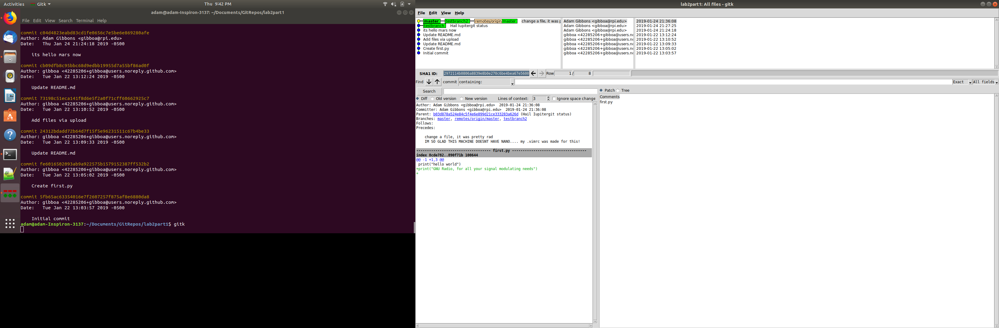

## Adam Gibbons Lab2

### Part 1
Branching Diagram...

gitk wasnt working, still not working after following instructions from Mattermost, will try again on linux
set it up on linux...

### Part 2

link to fork
https://github.com/gibboa/Spoon-Knife

Branching lessons

### Part 3

link to pull request:
https://github.com/wdturner/PullReq/pull/24
and actual repository:
https://github.com/gibboa/PullReq

link to courseproject repository:
https://github.com/gibboa/courseproject

link to table repository:
https://github.com/krishg4/ProjectIdeas2019
https://github.com/krishg4/ProjectIdeas2019/tree/Table8 ???
