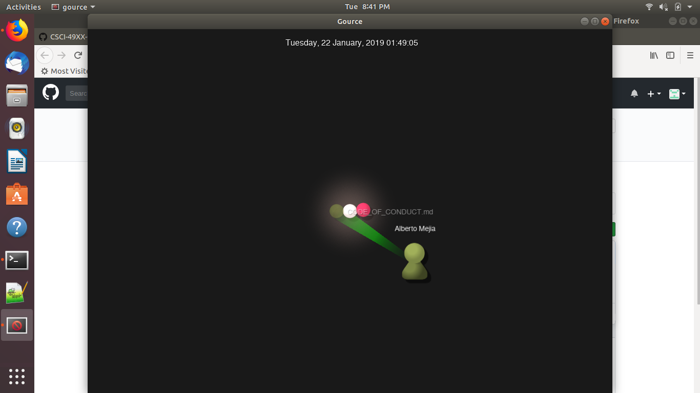
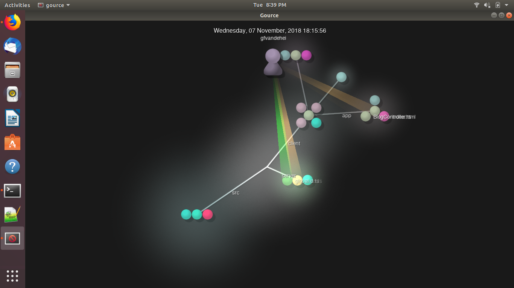

## Lab 3 - Adam Gibbons

### Part 0

### Part 1

#### project 1: runelite
Contributors: 14

Lines: 3187

First Commit: 2/4/18

Latest Commit: 1/29/19, 8 hours ago

Current Branches: master
#### project 2: RushMeiOS
Contributors: 3

Lines: 138326

First Commit: 2/4/18

Latest Commit: 1/6/19

Current Branches: Cam, Chat, ErrorSystem, NewLook, Notification, SaveFrats, calendar, chages-jim, favorites, linted-version and master
#### project 3: Schedj
Contributors: 2

Lines: 13722

First Commit: 1/18/19

Latest Commit: 1/25/19

Current Branches: master
#### project 4: ScheduleThis

contributors: 1

total lines: 732

first commit: Thu Jan 17 17:04:18 2019

latest commit: Tue Jan 22 02:30:48 2019

current branches: 1. Master

Comments after running gitstat:

all information is exactly the same in gitstats

Photo of gource video:

Only one contributor... self-proclaimed leader
#### project 5: Second-String/FrontEnd-Express

contributors: 3

total lines: 9768

first commit: Tue Oct 23 18:35:40 2018

last commit: Fri Jan 25 16:26:45 2019

current branches: 3: master, nick-statsheet, gfvandehei-homepage

Comments after running gitstat:

It shows 5 authors but 2 of them are the same people using different user names.	It only counts 9347 lines... but it has a graph so it must be right? It shows the same date for the last commit and first commit
(cant find branch information)

Photo of gource video:

The leader looks like Gabriel Van Dehei, he started it and did the most work

### Part 2

### Part 3
