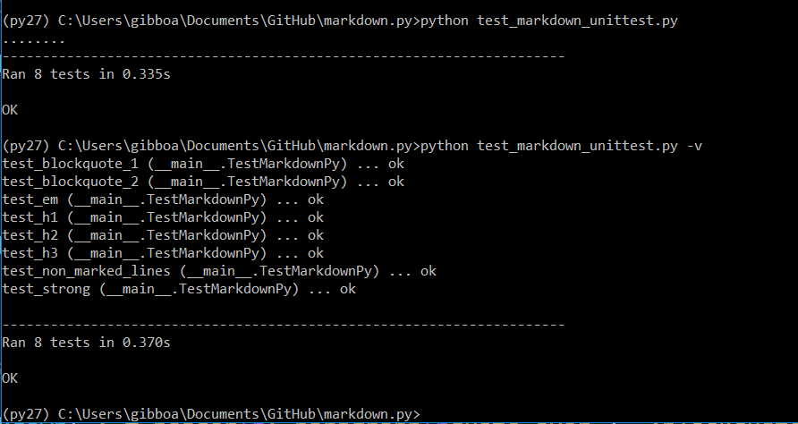

## Lab 3 - Adam Gibbons

### Part 0

Link to latex file:

https://github.com/gibboa/OpenSourceLabs/blob/master/lab3/lab3_latex.tex

Pic of Latex output:

### Part 1

#### project 1: runelite
Contributors: 14

Lines: 3187

First Commit: 2/4/18

Latest Commit: 1/29/19, 8 hours ago

Current Branches: master

Comments after running gitstats:

Looking through the gitstats it's fairly clear that for most, if not all, of the projects, the stats taken via hand was way off compared to stats taken via gitstats

Photo from gource:

#### project 2: RushMeiOS
Contributors: 3

Lines: 138326

First Commit: 2/4/18

Latest Commit: 1/6/19

Current Branches: Cam, Chat, ErrorSystem, NewLook, Notification, SaveFrats, calendar, chages-jim, favorites, linted-version and master

Comments after running gitstats:

Photo from gource:

#### project 3: Schedj

Contributors: 2

Lines: 13722

First Commit: 1/18/19

Latest Commit: 1/25/19

Current Branches: master

Comments after running gitstats:

gitstats found only one contributor and a slightly smaller number of lines of code. Uncertain of why this is, though the former discrepancy could just be that the RCOS page (my source) uses a more generous definition of "contributor". Likewise, the slight differences in the number of lines of code could just amount to the different ways of counting lines used by gitstats and the git ls-files -z | xargs -0 wc -l command.

Photo from gource:

#### project 4: ScheduleThis

contributors: 1

total lines: 732

first commit: Thu Jan 17 17:04:18 2019

latest commit: Tue Jan 22 02:30:48 2019

current branches: 1. Master

Comments after running gitstats:

all information is exactly the same in gitstats

Photo of gource video:

Only one contributor... self-proclaimed leader
#### project 5: Second-String/FrontEnd-Express

contributors: 3

total lines: 9768

first commit: Tue Oct 23 18:35:40 2018

last commit: Fri Jan 25 16:26:45 2019

current branches: 3: master, nick-statsheet, gfvandehei-homepage

Comments after running gitstats:

It shows 5 authors but 2 of them are the same people using different user names.	It only counts 9347 lines... but it has a graph so it must be right? It shows the same date for the last commit and first commit
(cant find branch information)

Photo of gource video:

The leader looks like Gabriel Van Dehei, he started it and did the most work

### Part 2

Link to markdown.py:

https://github.com/gibboa/OpenSourceLabs/blob/master/lab3/markdown.py

Link to unit test:

https://github.com/gibboa/OpenSourceLabs/blob/master/lab3/test_markdown_unittest.py

Pic of Unit test Results:

Table 8 Fellows: Krishg4, Drochecsp2017
