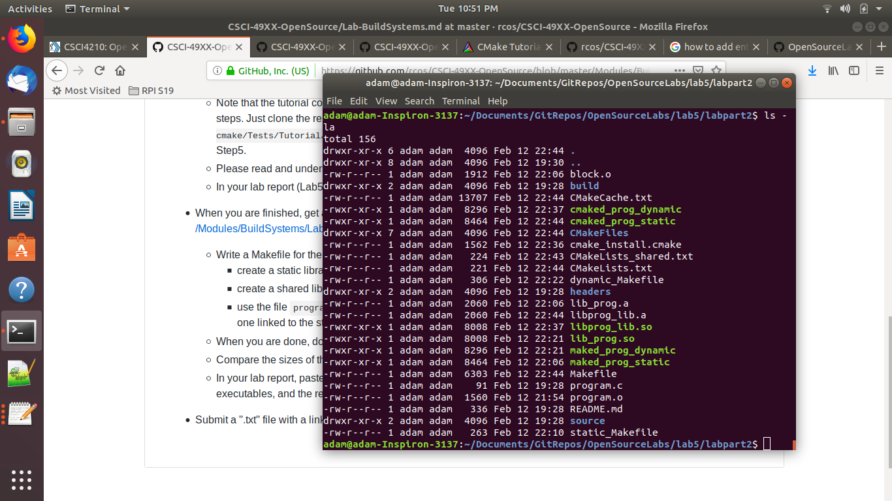
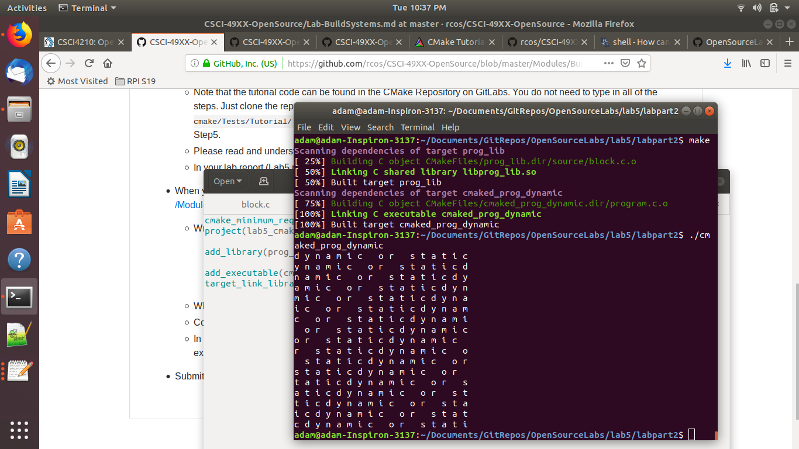

## OSS Lab 5 - Adam Gibbons - S19

### Cmake Tutorial

Providing screenshots of steps 1-5 by the folders (1-3 in the tutorial)

#### Step 1

#### Step 2

#### Step 3

#### Step 4

#### Step 5

### My First Make File

#### Static Makefile:

<pre>
all: maked_prog_static
maked_prog_static: program.o lib_prog.a
	cc program.o lib_prog.a -o maked_prog_static
program.o: program.c
	cc -c program.c -o program.o
lib_prog.a: block.o
	ar qc lib_prog.a block.o
block.o: source/block.c
	cc -c source/block.c -o block.o
</pre>

#### Dynamic Makefile

<pre>
all: maked_prog_dynamic
maked_prog_dynamic: program.o lib_prog.so
	cc program.o lib_prog.so -o maked_prog_dynamic -Wl,-rpath='$$ORIGIN'
program.o: program.c
	cc -c program.c -o program.o
lib_prog.so: block.o
	cc -shared -o lib_prog.so block.o
block.o: source/block.c
	cc -fPIC -c source/block.c -o block.o
</pre>

#### Static CMakeLists.txt

<pre>
cmake_minimum_required(VERSION 3.0)
project(lab5_cmake_static)

add_library(prog_lib STATIC source/block.c headers/block.h)

add_executable(cmaked_prog_static program.c)
target_link_libraries(cmaked_prog_static prog_lib)
</pre>

#### Shared CMakeLists.txt

<pre>
cmake_minimum_required(VERSION 3.0)
project(lab5_cmake_dynamic)

add_library(prog_lib SHARED source/block.c headers/block.h)

add_executable(cmaked_prog_dynamic program.c)
target_link_libraries(cmaked_prog_dynamic prog_lib)
</pre>

The file sizes of the executables are shown in the picture below. 
For both Cmake and Make, the shared/dynamic library executables are larger than the static ones by a small amount.

Here's the output from the program... it's for one executable but the output was the same for all of them.

And heres a copy of the CMaked Makefile....

<pre>
# CMAKE generated file: DO NOT EDIT!
# Generated by "Unix Makefiles" Generator, CMake Version 3.14

# Default target executed when no arguments are given to make.
default_target: all

.PHONY : default_target

# Allow only one "make -f Makefile2" at a time, but pass parallelism.
.NOTPARALLEL:

#=============================================================================
# Special targets provided by cmake.

# Disable implicit rules so canonical targets will work.
.SUFFIXES:

# Remove some rules from gmake that .SUFFIXES does not remove.
SUFFIXES =

.SUFFIXES: .hpux_make_needs_suffix_list

# Suppress display of executed commands.
$(VERBOSE).SILENT:

# A target that is always out of date.
cmake_force:

.PHONY : cmake_force

#=============================================================================
# Set environment variables for the build.

# The shell in which to execute make rules.
SHELL = /bin/sh

# The CMake executable.
CMAKE_COMMAND = /usr/local/bin/cmake

# The command to remove a file.
RM = /usr/local/bin/cmake -E remove -f

# Escaping for special characters.
EQUALS = =

# The top-level source directory on which CMake was run.
CMAKE_SOURCE_DIR = /home/adam/Documents/GitRepos/OpenSourceLabs/lab5/labpart2

# The top-level build directory on which CMake was run.
CMAKE_BINARY_DIR = /home/adam/Documents/GitRepos/OpenSourceLabs/lab5/labpart2

#=============================================================================
# Targets provided globally by CMake.

# Special rule for the target rebuild_cache
rebuild_cache:
	@$(CMAKE_COMMAND) -E cmake_echo_color --switch=$(COLOR) --cyan "Running CMake to regenerate build system..."
	/usr/local/bin/cmake -S$(CMAKE_SOURCE_DIR) -B$(CMAKE_BINARY_DIR)
.PHONY : rebuild_cache

# Special rule for the target rebuild_cache
rebuild_cache/fast: rebuild_cache

.PHONY : rebuild_cache/fast

# Special rule for the target edit_cache
edit_cache:
	@$(CMAKE_COMMAND) -E cmake_echo_color --switch=$(COLOR) --cyan "No interactive CMake dialog available..."
	/usr/local/bin/cmake -E echo No\ interactive\ CMake\ dialog\ available.
.PHONY : edit_cache

# Special rule for the target edit_cache
edit_cache/fast: edit_cache

.PHONY : edit_cache/fast

# The main all target
all: cmake_check_build_system
	$(CMAKE_COMMAND) -E cmake_progress_start /home/adam/Documents/GitRepos/OpenSourceLabs/lab5/labpart2/CMakeFiles /home/adam/Documents/GitRepos/OpenSourceLabs/lab5/labpart2/CMakeFiles/progress.marks
	$(MAKE) -f CMakeFiles/Makefile2 all
	$(CMAKE_COMMAND) -E cmake_progress_start /home/adam/Documents/GitRepos/OpenSourceLabs/lab5/labpart2/CMakeFiles 0
.PHONY : all

# The main clean target
clean:
	$(MAKE) -f CMakeFiles/Makefile2 clean
.PHONY : clean

# The main clean target
clean/fast: clean

.PHONY : clean/fast

# Prepare targets for installation.
preinstall: all
	$(MAKE) -f CMakeFiles/Makefile2 preinstall
.PHONY : preinstall

# Prepare targets for installation.
preinstall/fast:
	$(MAKE) -f CMakeFiles/Makefile2 preinstall
.PHONY : preinstall/fast

# clear depends
depend:
	$(CMAKE_COMMAND) -S$(CMAKE_SOURCE_DIR) -B$(CMAKE_BINARY_DIR) --check-build-system CMakeFiles/Makefile.cmake 1
.PHONY : depend

#=============================================================================
# Target rules for targets named prog_lib

# Build rule for target.
prog_lib: cmake_check_build_system
	$(MAKE) -f CMakeFiles/Makefile2 prog_lib
.PHONY : prog_lib

# fast build rule for target.
prog_lib/fast:
	$(MAKE) -f CMakeFiles/prog_lib.dir/build.make CMakeFiles/prog_lib.dir/build
.PHONY : prog_lib/fast

#=============================================================================
# Target rules for targets named cmaked_prog_static

# Build rule for target.
cmaked_prog_static: cmake_check_build_system
	$(MAKE) -f CMakeFiles/Makefile2 cmaked_prog_static
.PHONY : cmaked_prog_static

# fast build rule for target.
cmaked_prog_static/fast:
	$(MAKE) -f CMakeFiles/cmaked_prog_static.dir/build.make CMakeFiles/cmaked_prog_static.dir/build
.PHONY : cmaked_prog_static/fast

program.o: program.c.o

.PHONY : program.o

# target to build an object file
program.c.o:
	$(MAKE) -f CMakeFiles/cmaked_prog_static.dir/build.make CMakeFiles/cmaked_prog_static.dir/program.c.o
.PHONY : program.c.o

program.i: program.c.i

.PHONY : program.i

# target to preprocess a source file
program.c.i:
	$(MAKE) -f CMakeFiles/cmaked_prog_static.dir/build.make CMakeFiles/cmaked_prog_static.dir/program.c.i
.PHONY : program.c.i

program.s: program.c.s

.PHONY : program.s

# target to generate assembly for a file
program.c.s:
	$(MAKE) -f CMakeFiles/cmaked_prog_static.dir/build.make CMakeFiles/cmaked_prog_static.dir/program.c.s
.PHONY : program.c.s

source/block.o: source/block.c.o

.PHONY : source/block.o

# target to build an object file
source/block.c.o:
	$(MAKE) -f CMakeFiles/prog_lib.dir/build.make CMakeFiles/prog_lib.dir/source/block.c.o
.PHONY : source/block.c.o

source/block.i: source/block.c.i

.PHONY : source/block.i

# target to preprocess a source file
source/block.c.i:
	$(MAKE) -f CMakeFiles/prog_lib.dir/build.make CMakeFiles/prog_lib.dir/source/block.c.i
.PHONY : source/block.c.i

source/block.s: source/block.c.s

.PHONY : source/block.s

# target to generate assembly for a file
source/block.c.s:
	$(MAKE) -f CMakeFiles/prog_lib.dir/build.make CMakeFiles/prog_lib.dir/source/block.c.s
.PHONY : source/block.c.s

# Help Target
help:
	@echo "The following are some of the valid targets for this Makefile:"
	@echo "... all (the default if no target is provided)"
	@echo "... clean"
	@echo "... depend"
	@echo "... rebuild_cache"
	@echo "... edit_cache"
	@echo "... prog_lib"
	@echo "... cmaked_prog_static"
	@echo "... program.o"
	@echo "... program.i"
	@echo "... program.s"
	@echo "... source/block.o"
	@echo "... source/block.i"
	@echo "... source/block.s"
.PHONY : help

#=============================================================================
# Special targets to cleanup operation of make.

# Special rule to run CMake to check the build system integrity.
# No rule that depends on this can have commands that come from listfiles
# because they might be regenerated.
cmake_check_build_system:
	$(CMAKE_COMMAND) -S$(CMAKE_SOURCE_DIR) -B$(CMAKE_BINARY_DIR) --check-build-system CMakeFiles/Makefile.cmake 0
.PHONY : cmake_check_build_system

</pre>
