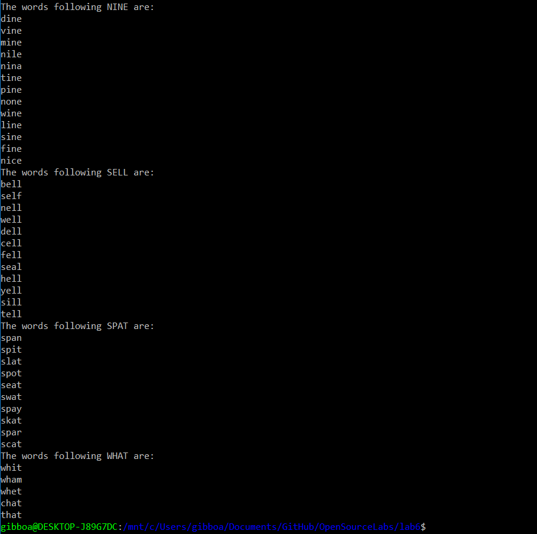

### Lab 6 - Adam Gibbons

#### I: Five Letter Words (ordered)
Below are the results for the 4 five letter pairs:

#### II: Four Letter Words (ordered)

[link to code for 4 letter solution](https://github.com/gibboa/OpenSourceLabs/blob/master/lab6/word_ladders_4.py)
(just changed a few lines concerning the file name, length of words, and test words to use)

Results for the two pairs of four letter words follow:

#### III: Five Letter Words (unordered)

[link to code for 5 letter/unordered solution](https://github.com/gibboa/OpenSourceLabs/blob/master/lab6/word_ladders_no_order.py)

The link to the file is above, but here is also the most substantial rewrite used to create a graph that allows all permutations of words

<pre>
words_list = list(words)
    adj_words = set()
    for i in range(len(words_list)-1):
        for j in range(i + 1, len(words_list)):
            word_i = Counter(words_list[i])
            word_j = Counter(words_list[j])
            if sum( (word_i - word_j).values() ) == 1:
                word1 = words_list[i]
                word2 = words_list[j]
                adj_words.add( (word1, word2) )

    G.add_nodes_from(words)
    for word, cand in adj_words:
        ##print(word, cand)
        G.add_edge(word, cand)
    return G
</pre>

Results for the unordered version of 5 letter words follow:

#### IV: Precede and Follow...

[link to code for 5 letter/unordered solution](https://github.com/gibboa/OpenSourceLabs/blob/master/lab6/procede_follow.py)

(not sure if my results are correct... the code is the same as the example for building the graph, I just added a function to check the neighbors of the given word)
(also stat wasnt in the 4 letter word dictionary)

Results for Precede:

Results for Follow:

