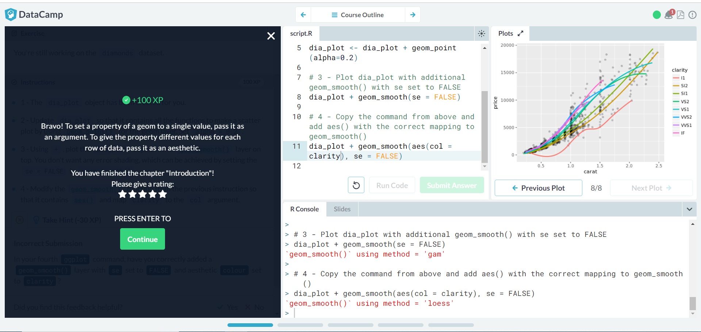
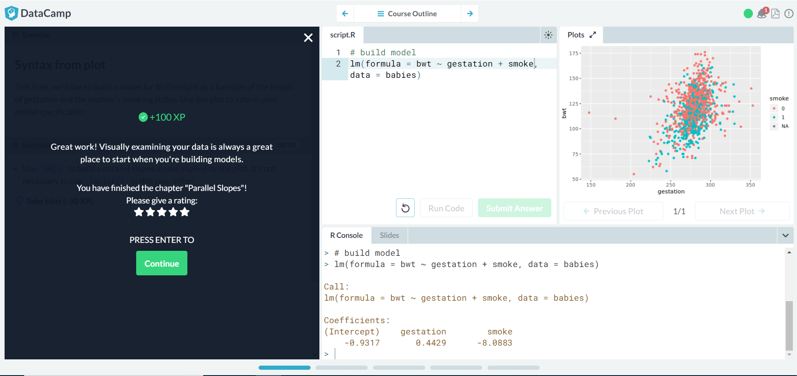

## Lab 7 Adam Gibbons

### Data Camp
#### Data Visualization with ggplot2 (Part 1)

photo of completed part 1:

#### Multiple and Logistic Regression (Part 1)

photo of completed part 1:

(Screenshots of individual steps in the lessons are in the repository.)

### Project
Project Name: [Open_IO](https://rcos.io/projects/gibboa/open_io/profile)

#### Blog Post
[link to blog post](https://rcos.io/projects/gibboa/open_io/blog)
