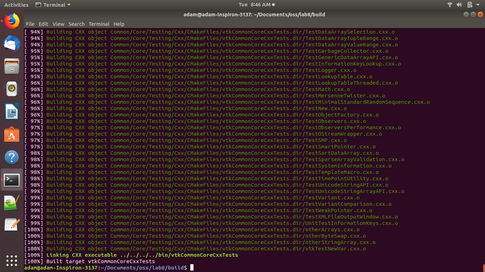
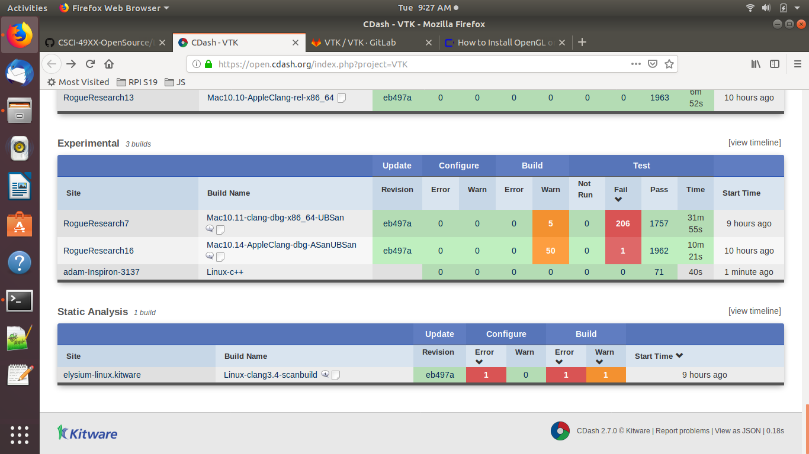
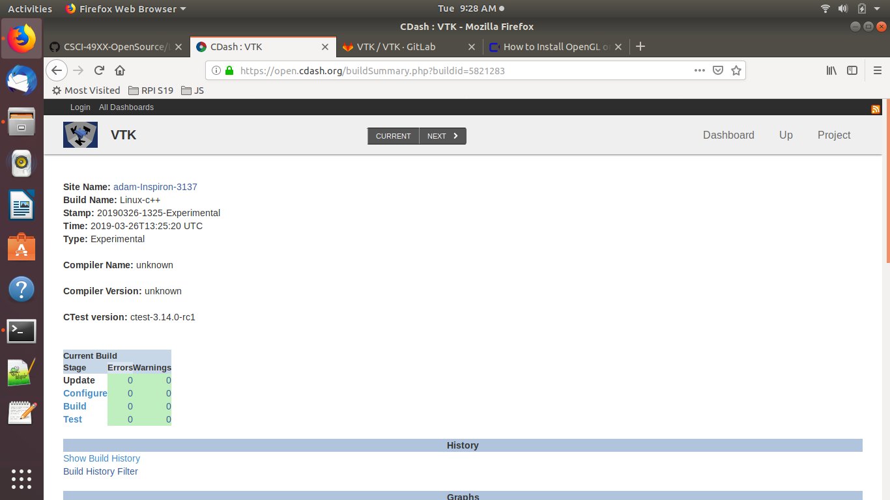
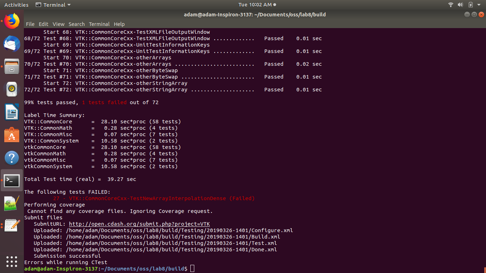
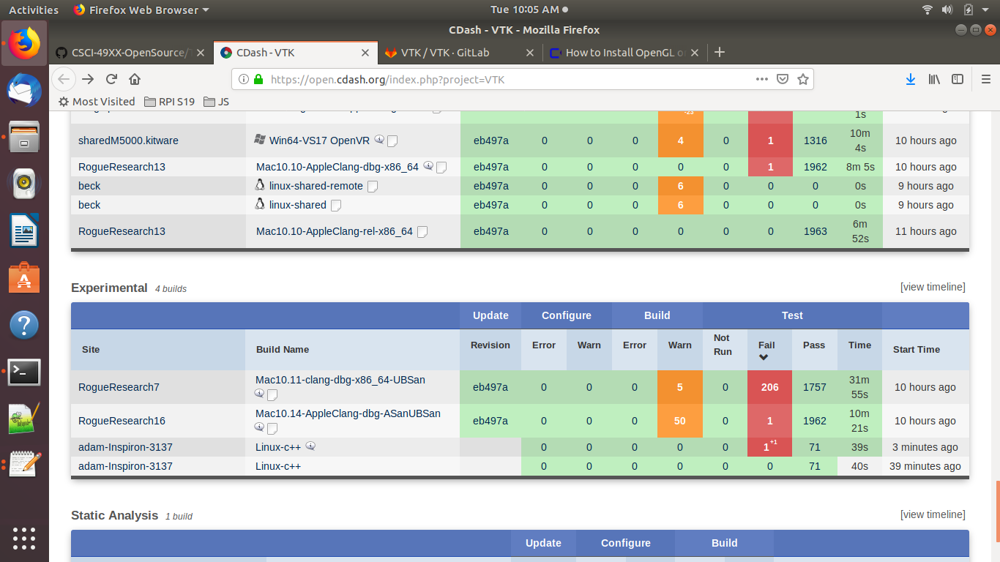
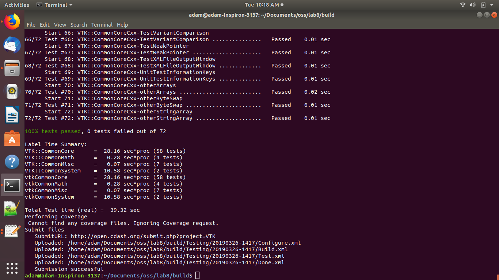
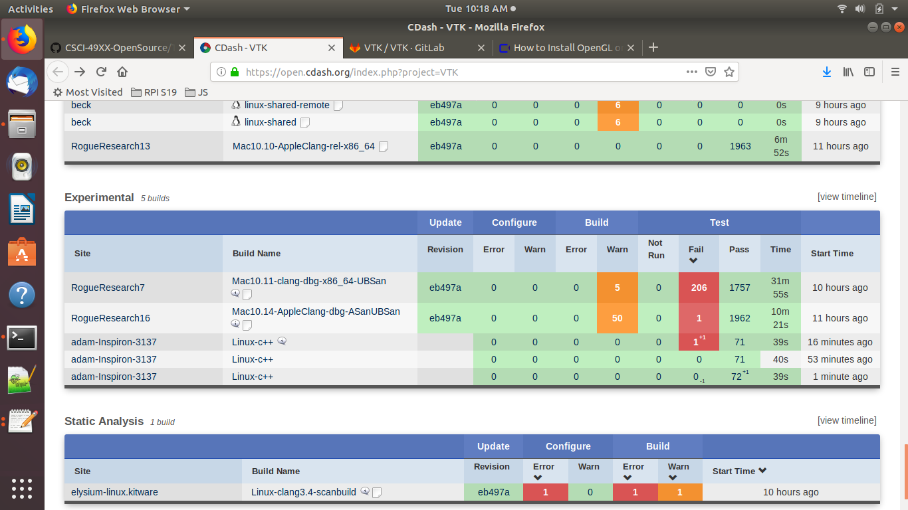

## Adam Gibbons - Lab 8

### Part 1

photo of completed build:

### Part 2

1.
I can see what tests were run by clicking on the number/link in the fail/pass/warn columns

If I click on a particular test that has failed, it shows information about the line and error message related to the failure.

### Part 3

It doesn't quite work the way I thought. The line numbers are not from the test files themselves. But I can see the error output so I know it occurred at the line:

test_new_expression(d->GetValue(0, 1) == 4, "Error: expected 2");

### part 4

the fix was:

test_new_expression(d->GetValue(0, 1) == 2, "Error: expected 2");

(too easy, maybe I'm missing something)

