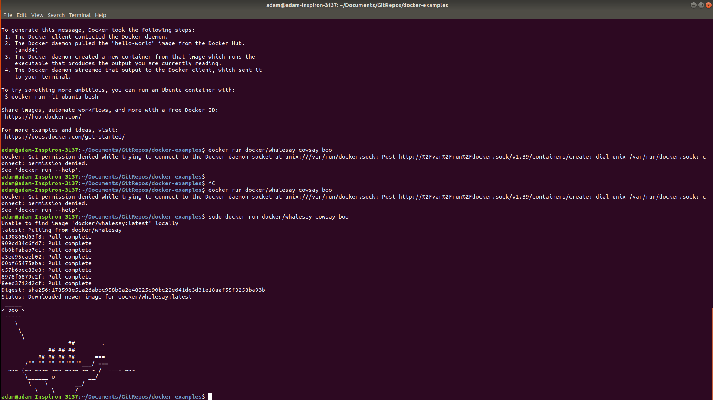
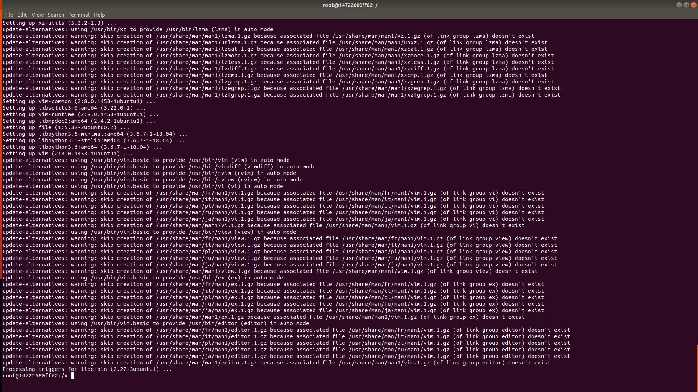
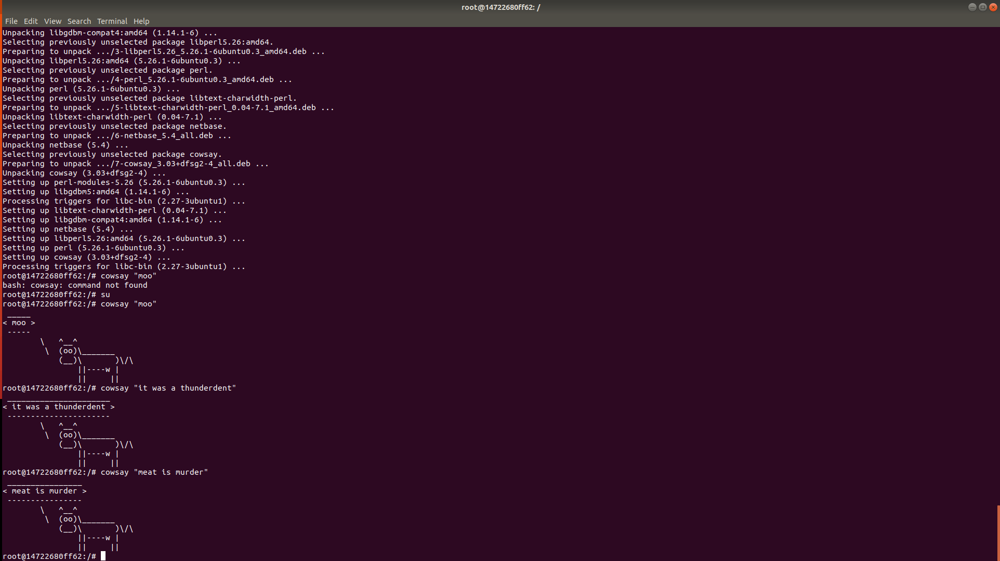
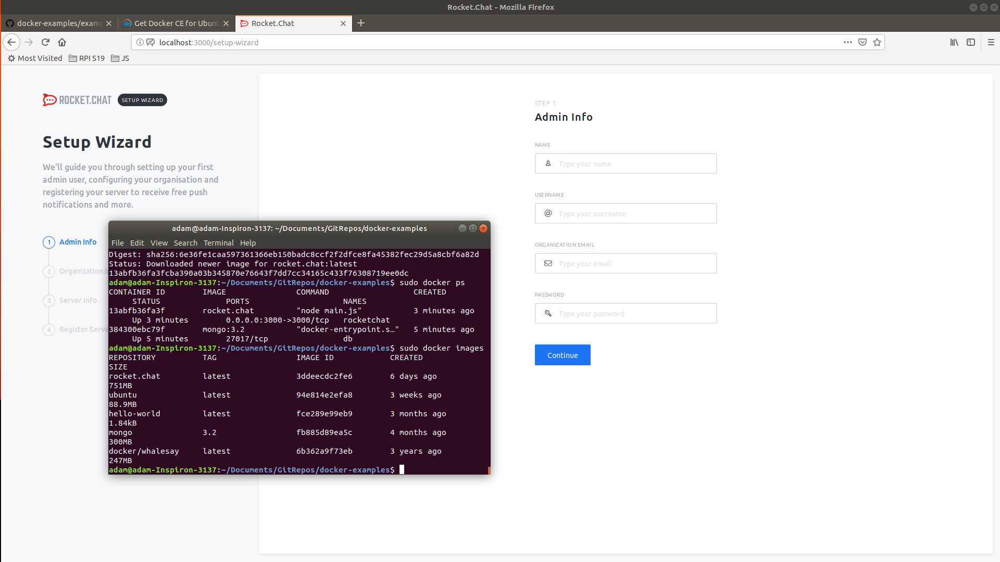
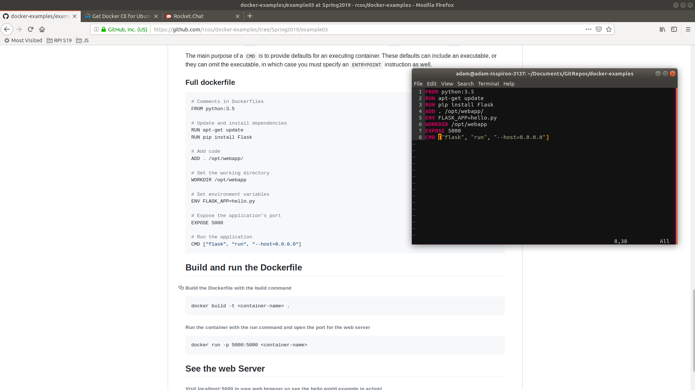
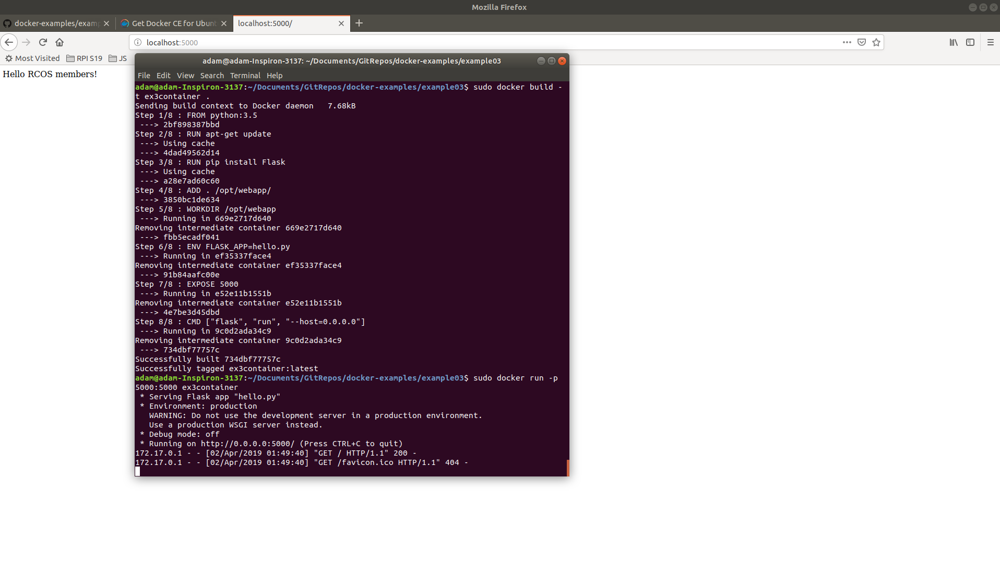
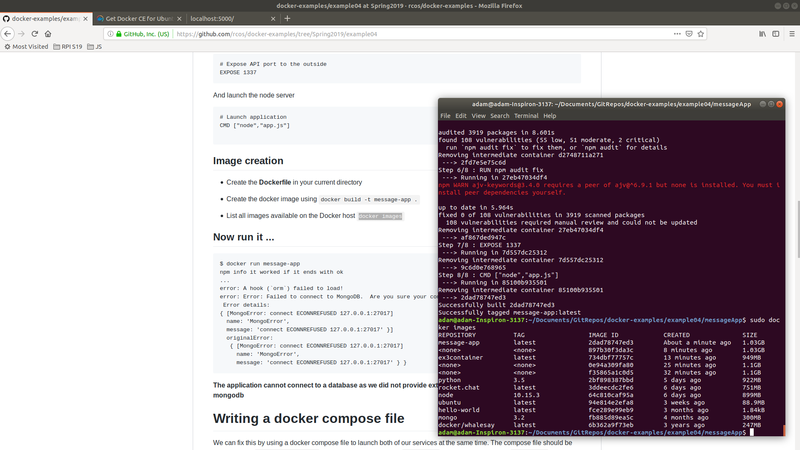
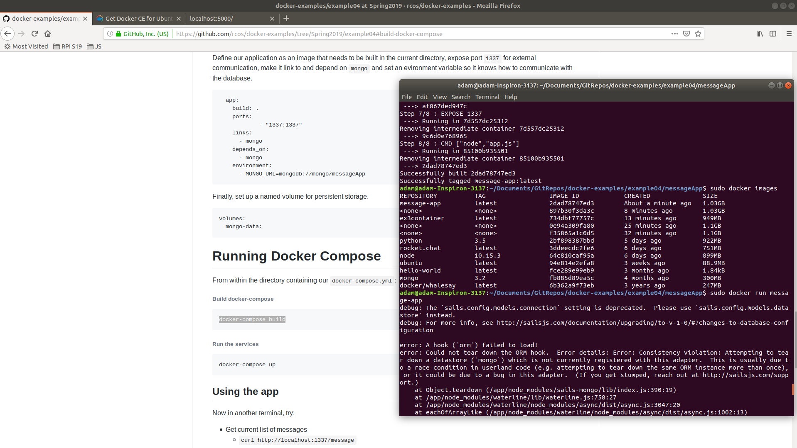
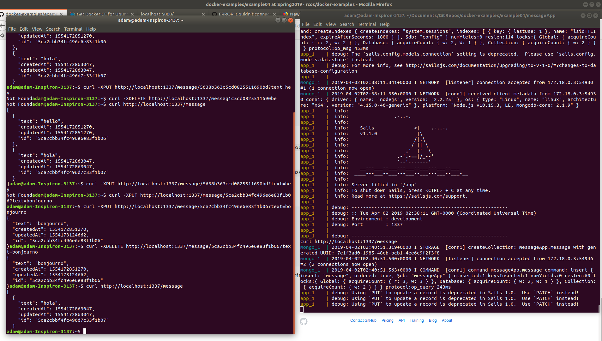

## Adam Gibbons Lab 9

Installed

### Example 1

Running Ubuntu in container, installed vim

The Cow says "Moo"

### Example 2

Rocketchat working

### Example 3

Dockerfile...

It works

### Example 4

Built and then showing images

Showing error on run without the compose file

After creating the compose file. Built it and now the chat is running and the commands/output are in the terminal on the left.

